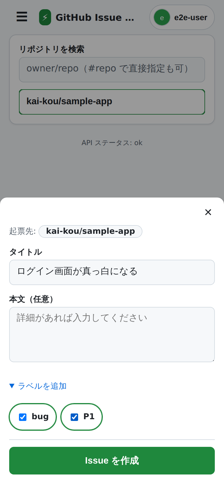
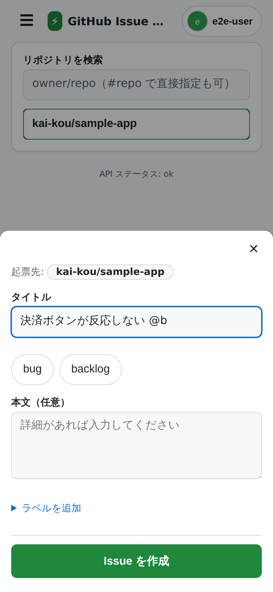
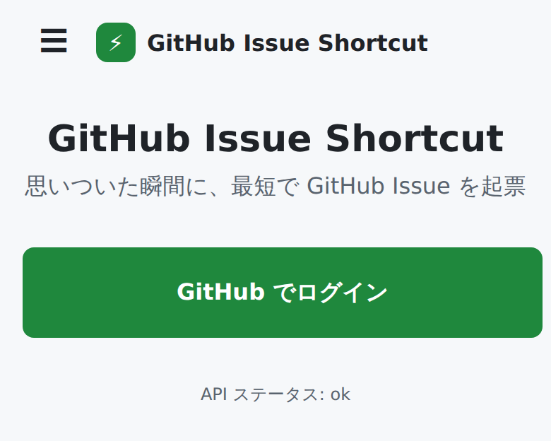

# GitHub Issue Shortcut

[](https://github.com/kai-kou/github-issue-shortcut/actions/workflows/ci.yml)
[](LICENSE)
[](https://github-issue-shortcut.kinamocchi-tech.workers.dev)

**「思いついた瞬間」を逃さない。ホーム画面をタップして数秒で GitHub に Issue を立てる、Android 向けの PWA です。**

PAT（個人アクセストークン）の発行も管理も不要 — GitHub でログインするだけ。ショートカットがリポジトリとラベルを覚えているので、タップした時点で入力欄にカーソルが立っています。

**サーバーはあなたのデータを保存しません。** GitHub のトークンは暗号化した Cookie としてあなたの端末に置かれ、サーバーはリクエストのたびに復号して GitHub へ中継するだけです（データベースを持っていません）。

👉 **[アプリを開く](https://github-issue-shortcut.kinamocchi-tech.workers.dev)**

| 起票フォーム | スマート入力（`@` でラベル候補） | ログイン |
|---|---|---|
|  |  |  |

## なぜ作ったか

GitHub Issues でタスクやアイデアを管理していると、**思いついた瞬間にスマホから書き留める** のが一番難しくなります。

- GitHub 公式アプリは起票まで **3〜4 タップ + 4 画面** かかり、ホーム画面からの直行導線がない
- `issues/new` のプレフィル URL をショートカットにする手はあるが、公式アプリがリンクを横取りしてプレフィルを落とすことがある
- HTTP Shortcuts 等で自作すると動くが、**PAT の手動発行・管理** が最大の摩擦になる
- iOS には専用アプリが複数あるのに、**Android × PWA でワンタップ起票できるツールは調べた限り見当たらない**

そこで「ホーム画面タップ → 数秒で起票」だけに特化した PWA を作りました。競合調査の詳細は [市場・競合リサーチ](docs/research/2026-07-10-market-competitors.md) にあります。

## できること

- **GitHub ログインだけで使える** — 要求する権限は Issues（Read and write）のみ。コードには一切アクセスしません
- **ショートカット起動** — `/new?repo=owner/name&labels=bug&title=雛形` でリポジトリ・ラベル・タイトルを初期選択した状態で開けます。ホーム画面にいくつでも並べられます
- **アイコン長押しメニュー** — よく使うプリセットを最大 3 個、PWA のショートカットとして登録できます
- **共有シートから起票** — Android の共有シートに本アプリが出ます。記事の URL を共有すれば本文にプレフィルされます
- **スマート入力** — タイトル欄に `#repo` `@label` と打つとインラインで候補が出て、そのまま指定できます
- **ラベル権限の事前警告** — push 権限のないリポジトリではラベルが黙って捨てられるため、送信前に警告します
- **オフラインでも書ける** — 圏外での起票はキューに保存され、次にアプリのホーム画面を開いたときに自動で再送されます（二重起票はしません）
- **送信に失敗しても入力は消えない** — 下書きを端末内に保全します
- **日本語 / English** の 2 言語対応

## 目指している速さ

以下は本プロジェクトが目標としている値です（[プロジェクトミッション](docs/project-mission.md) の KPI と同一）。実測値ではありません。

| 指標 | 目標 |
|------|------|
| 起票所要時間（起動 → 作成完了） | 10 秒以内（タイトルのみなら 5 秒以内） |
| 起票までのタップ数（ショートカット起動時） | 3 タップ以内 |
| 起票成功率 | 99% 以上（失敗しても入力内容を失わない） |
| 初回セットアップ（ログイン → 初起票） | 5 分以内 |

## 技術構成

| レイヤー | 採用技術 |
|---------|---------|
| フロントエンド | Vite + React 19（SPA / PWA） |
| API | Hono（Cloudflare Workers 上で動作） |
| ホスティング | Cloudflare Workers（単一 Worker 構成） |
| 認証 | GitHub App（OAuth）+ 暗号化 HttpOnly Cookie |
| データ | 端末内（localStorage / IndexedDB）のみ。**サーバーは永続層を持たない**（D1 / KV / R2 / Durable Objects のいずれも使っていません） |
| CI | GitHub Actions（テスト・型チェック・E2E・Lighthouse） |
| デプロイ | Cloudflare Workers Builds（Git 連携・キーレス） |

サーバーが何も保存しない設計の詳細は [ステートレス化設計](docs/design/stateless-architecture.md)、どのデータがどこに保持されるかの全数棚卸しは [データ保持インベントリ](docs/research/2026-07-28-data-retention-inventory.md) にまとめています。

## 開発

```bash
npm ci             # 依存インストール
npm run dev        # ローカル開発サーバー（Vite）
npm run build      # 型チェック（tsc -b）+ ビルド
npm test           # ユニットテスト（vitest / @cloudflare/vitest-pool-workers）
npm run e2e        # E2E テスト（Playwright・GitHub API はモック）
```

デプロイは Cloudflare Workers Builds（Git 連携）が担当します。要件・アーキテクチャの詳細は [`docs/requirements/`](docs/requirements/) を参照してください。

## AI エージェントによる自律開発運用

本リポジトリは **Claude Code による自律開発運用**（[claude-code-base](https://github.com/kai-kou/claude-code-base) 由来のルール・スキル・ハーネス）を採用しています。Issue の起票から実装・レビュー・PR のマージまでの多くの工程を AI エージェントが自律実行しており、その運用ルール自体もリポジトリ内で管理しています。

- [`CLAUDE.md`](CLAUDE.md) — エージェントへの運用指示（大原則・確認境界・PR フロー）
- [`docs/rules/`](docs/rules/) — ルールの実体（自律運用ポリシー・レビュー体制・教訓集）
- [`content/discussions/`](content/discussions/) — 設計判断を専門エージェント同士が議論した記録

仕組みそのものに興味がある方は、こちらもご覧ください。

## ドキュメント

- [要件定義](docs/requirements/) — FR / NFR・アーキテクチャ・マイルストーン計画
- [プロジェクトミッション](docs/project-mission.md) — ミッション・KPI・判断基準
- [リサーチ](docs/research/) — 認証・技術スタック・市場調査・公開リスク

## ライセンス

[MIT License](LICENSE) の下で公開しています。
